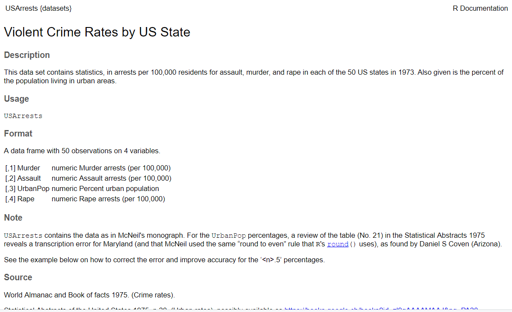
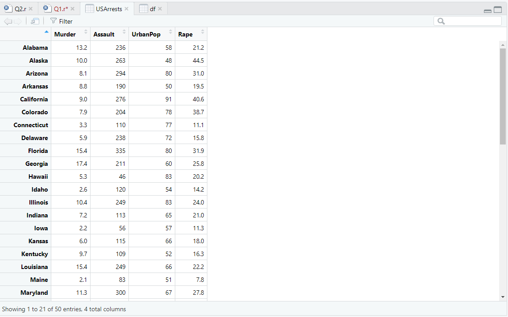
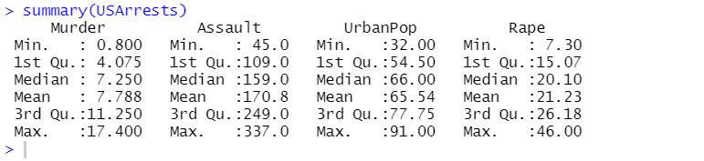
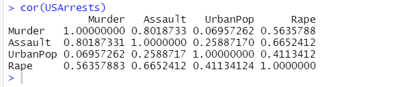
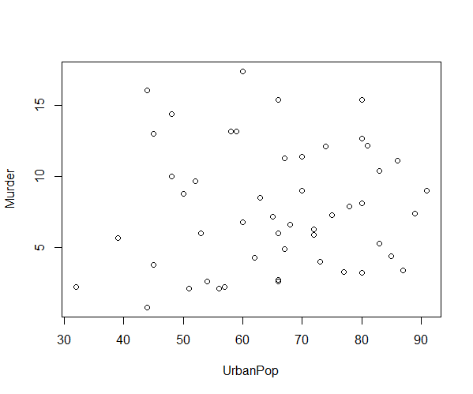
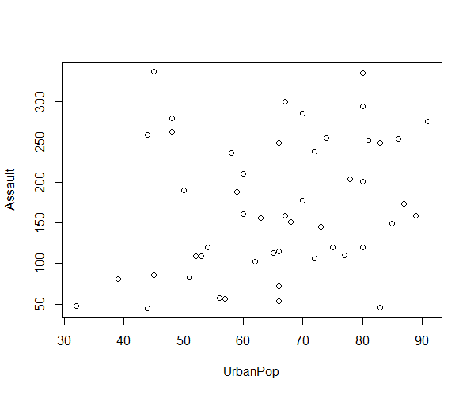
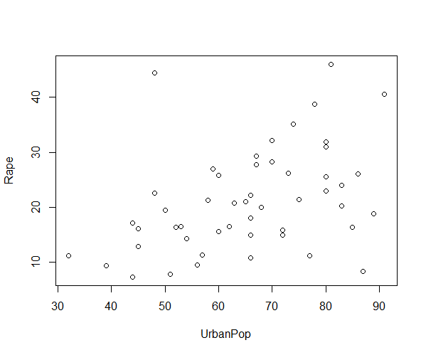
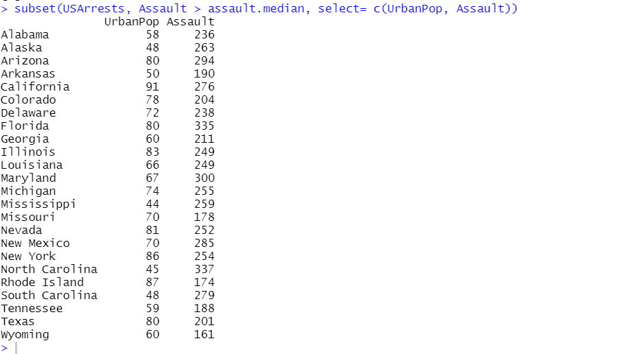
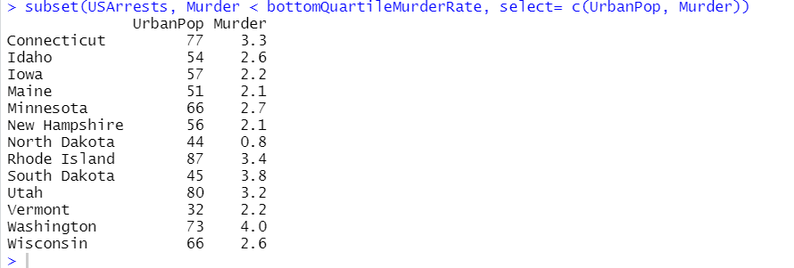
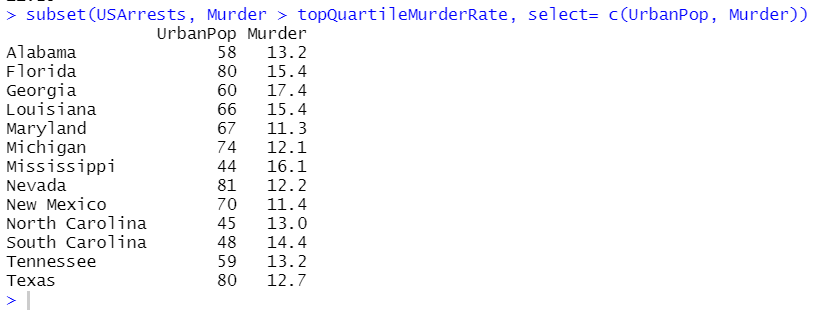

# Question 1
Use the “USArrests” built-in dataset to plot beautiful graphs and find meaningful insight about the dataset. You may draft questions yourself and summarize the results. You will be marked for [10]
a. Creativity
b. Presentation
c. Originality
d. Summarization of results


### Getting to know the dataset
Let us start by viewing and understanding the dataset.
```r
data(USArrests)
help(USArrests)
```



```r
names(USArrests)
```
>[1] "Murder"   "Assault"  "UrbanPop" "Rape" 

```r
dim(USArrests)
```
> [1] 50  4

```r
View(USArrests)
```



<div style="font-size:20px">
So this is a dataset about the arrest reports in USA. There are four attributes and we can try to find the relations between them. We can also try to find the least crime filled states or the most crime filled states.

The dataset provides us with a list of 50 rows (1 for each state) and its statistics for 4 types of crimes - Murder, Assault, UrbanPop and Rape.

Let us try to have some closer look at the dataset by obtaining its summary.
</div>

```r
summary(USArrests)
```


<div style="font-size:20px">
Let us also try to see if the four crimes have any correlation to each other.
</div>

<br>
```r
cor(USArrests)
```



<div style="font-size:20px">
Through the above data we infer that <b>Assault</b> are the most frequent crimes that are happening as it has the highest averages.
Further <b>Rape</b> crimes are the least likely to happen (which is a good thing).
</div>

### Visualising data
<div style="font-size:20px">
Running plot for these combinations, Murder and Assault do not appear to have a relation to UrbanPop. The distribution of plot points are scattered to the point that they do not appear to correlate to UrbanPop.
</div>
```r
with(USArrests, plot(UrbanPop, Murder))
```



<div style="font-size:18px">
We see that most murders are likely to occur with higher Urban population. Although this isn't a fair measure since the plot seems to be very scattered.


Let us try another one.
</div>


```r
with(USArrests, plot(UrbanPop, Assault))
```



<div style="font-size:18px">
It is quite evident that more Assaults are likely to occur with more Urban Population.
</div>

```r
with(USArrests, plot(UrbanPop, Rape))
```


<div style="font-size:18px">
Rape crimes are more likely to occur in states with average urban population. This goes to contrary to standard belief that more Urban population leads to more rapes.
</div>

#### Which states has most and least assault, murder, and rape arrests?
Let us try to figure out which states are more safer than the others so that if we ever plan a trip to US, we know where to steer clear off.

##### Most and Least assault
```r
x <- which(USArrests$Assault == max(USArrests$Assault))
rownames(USArrests)[x]
```
> [1] "North Carolina"
```r
x <- which(USArrests$Assault == min(USArrests$Assault))
rownames(USArrests)[x]
```
> [1] "North Dakota"

##### Most and Least murder
```r
x <- which(USArrests$Murder == max(USArrests$Murder))
rownames(USArrests)[x]
```
> [1] "Georgia"

```r
x <- which(USArrests$Murder == min(USArrests$Murder))
rownames(USArrests)[x]
```
> [1] "North Dakota"

##### Most and least rape
```r
x <- which(USArrests$Rape == max(USArrests$Rape))
rownames(USArrests)[x]
```
> [1] "Nevada"


```r
x <- which(USArrests$Rape == min(USArrests$Rape))
rownames(USArrests)[x]
```

> [1] "North Dakota"


#### States which have assault arrests more than median of the country.
```r
assault.median = median(USArrests$Assault)
assault.median
```
> [1] 159

```r
subset(USArrests, Assault > assault.median, select= c(UrbanPop, Assault))
```



#### States that are in the bottom 25% of murder
These are the safer states that I would prefer to go to.
```r
bottomQuartileMurderRate <- quantile(USArrests$Murder)[2]
bottomQuartileMurderRate
```
>    25% 
> 4.075
```r
subset(USArrests, Murder < bottomQuartileMurderRate, select= c(UrbanPop, Murder))
```


#### States  which are in the top 25% of the murder.
Better stay away from these states for our own safety.
```r
topQuartileMurderRate <- quantile(USArrests$Murder)[4]
topQuartileMurderRate
```
```sh
##   75% 
## 11.25
```

```r
subset(USArrests, Murder > topQuartileMurderRate, select= c(UrbanPop, Murder))
```
