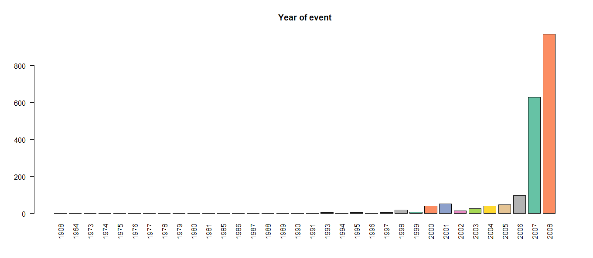
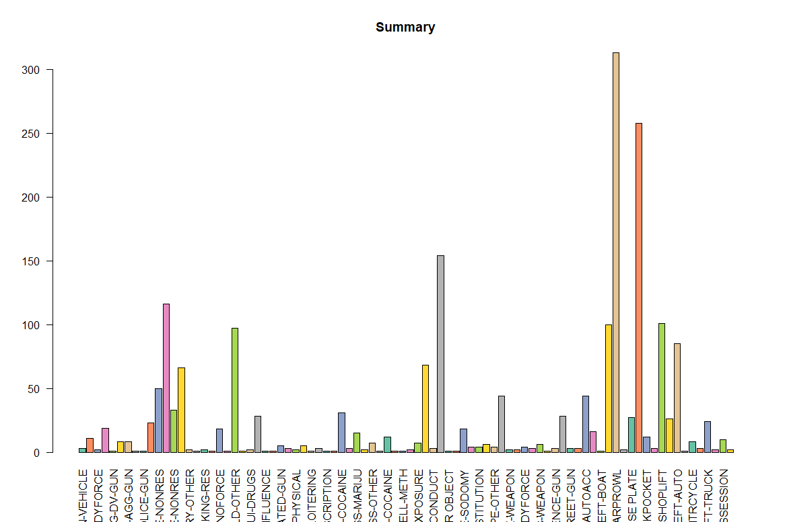

### Question 2
2. Download the file Set3.csv and write the correct code for each of the following : [15]
I. Read the contents of the file
II. Count of the number of records
III. View the data in a tabular format
IV. Filter the offences on the basis of Locality (QA only) and Type_of_offence (PHYSICAL OFFENSE only).
V. Group the offences by Zone.
VI. Get a count of the number of records for each group
VII. Using ggplot(), plot a barchart displaying the number of offences in each Zone. (use all the possible parameters)
VIII. Create a new column called Year_of_event containing the only the year of the event
IX. Group the data by year and summarize
X. Plot a barchart with column Year_of_event that displays the number of offences by year
XI. Create another bar chart that displays the number of offences by month instead of year
XII. Group and summarize the data by month.
XIII. Rename the columns to make them more user friendly and view the results
XIV. What’s the need of filtering the data? Show examples using appropriate commands
XV. What other charts can you plot for XI ? Which one will leverage more information and why?( elaborate in comments)


### Library Imports
```r
library(dplyr)
library(ggplot2)
library(lubridate)
library(RColorBrewer)
```

#### I. Read the contents of the file
```r
df <- read.csv('Set3.csv')
```

#### II. Count of the number of records
```r
count(df)
```


#### III. View the data in a tabular format
```r
View(df)
```


#### IV. Filter the offences on the basis of Locality (QA only) and Type_of_offence (PHYSICAL OFFENSE only).
```r
filteredDf <- df %>% filter(Locality == 'QA' & Type_of_offence=='PHYSICAL OFFENSE')
View(filteredDf)
```


#### V. Group the offences by Zone.
```r
zoneGroups <- df %>% group_by(Zone)
zoneGroups
```


#### VI. Get a count of the number of records for each group
```r
count(zoneGroups)
```


**Note:** The entries with Zone = 'UNKNOWN' were **intentionally** left in the dataframe and as can be seen above, they become a part of the analysis. This causes the following graph in Part 7 to get affected as well. The reason for this is explained in detail in **Part 14**. Kindly refer to it before thinking of this as a mistake.

#### VII. Using ggplot(), plot a barchart displaying the number of offences in each Zone. (use all the possible parameters)
```r
coul <- brewer.pal(8, "Set2") 
barplot(sort(table(zoneGroups$Zone), decreasing = T), las = 2, main = "Zone", col=coul)
```


Note that an alternative plot could also be constructed with the following function using the ggplot()
```r
# Alternative method to generate plot
ggplot(count(zoneGroups), aes(x=Zone,y=n)) + 
  geom_bar(stat="identity" )
```

However since the two plots are very like and the plot generated through barplot() is neater and cleaner, I have used that as my primary method. Following bar plots can also utilize the ggplot() method however only barplot() code is written for that.

#### VIII. Create a new column called Year_of_event containing the only the year of the event
```r
df$Year_of_event <- df %>% with(year(mdy(Date_of_event)))
View(df)
```


#### IX. Group the data by year and summarize
```r
yearGroup <- df %>% group_by(Year_of_event)
summary(yearGroup)
```


#### X. Plot a barchart with column Year_of_event that displays the number of offences by year
```r
barplot(table(yearGroup$Year_of_event), 
        las = 2, main = "Year of event", col=coul)
```


#### XI. Create another bar chart that displays the number of offences by month instead of year
```r
df$Month_of_event <- df %>% with(month(mdy(Date_of_event)))
                                 
monthGroup <- df %>% group_by(Month_of_event)

barplot(table(monthGroup$Month_of_event), 
        las = 2, main = "Month of event" ,col=coul)
```


#### XII. Group and summarize the data by month.
```r
df$Month_of_event <- df %>% with(month(mdy(Date_of_event)))

monthGroup <- df %>% group_by(Month_of_event)

summary(monthGroup)
```


#### XIII. Rename the columns to make them more user friendly and view the results
```r
names(df)[names(df) == "Summary_of_offence"] <- "Summary"
names(df)[names(df) == "Type_of_offence"] <- "Type"
View(df)
```


#### XIV. What’s the need of filtering the data? Show examples using appropriate commands
Filtering data allows us to clean up our data and remove the entries that provide no information to our analysis.
Further, keeping these entries in our dataset could harm our results potentially and ultimately lead to a wrong/faulty analysis.

Consider the given dataframe for this problem.
In the above analysis, part 6 & 7. when we created zoneGroups by grouping our data entries based on their zone, we noticed that one of the zones was defined as **"UNKNOWN"**.
This occured due to the fact that several entries in our dataset do not have any dataset defined.
This gives us a faulty barplot as well which contains one bar for **UNKNOWN** in it as can be seen above.

This can be corrected however by filtering our data properly and removing these entries before plotting the data.


Start by filtering out the data from the dataframe.
```r
df <- df %>% filter(!is.na(Zone) & Zone != 'UNKNOWN')
```


We notice that all entries with Zone = 'UNKNOWN' have been removed.

Now we run the same code as in part 6 & 7 above.
```r
zoneGroups <- df %>% group_by(Zone)
count(zoneGroups)
```

Note that the entries with UNKNOWN are now gone.

```r
barplot(sort(table(zoneGroups$Zone), decreasing = T), 
        las = 2, main = "Zone.", col=coul)
```

We finally get a proper graph without a meaningless entry in it.

#### XV. What other charts can you plot for XI ? Which one will leverage more information and why?( elaborate in comments)
There are several possibilities. Let us try a few of them out.

###### Bar chart that displays the number of offences by Type_of_offence
```r
barplot(table(df$Summary_of_offence), las = 2, main = "Summary",col=coul)
```


###### Bar chart that displays the number of offences by Summary_of_offence
```r
barplot(table(df$Summary_of_offence), las = 2, main = "Summary",col=coul)
```



###### Bar chart that displays the number of offences by Block
```r
barplot(table(df$Block[df$Block!=""]), las=2, main="Block", col=coul)
```

